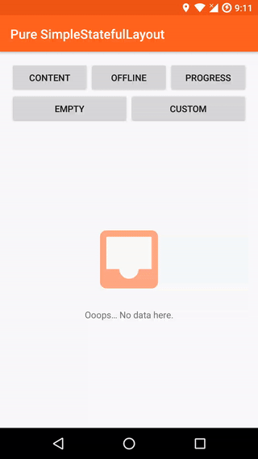

# Android StatefulLayout 2


## StatefulLayout
    compile 'cz.kinst.jakub:android-stateful-layout-base:2.0.2'
    
This is a base class you should **use if you want to have completely custom set of states/views**. You can either **inherit** and add custom states in constructor 
(see `SimpleStatefulLayout` as an example) or you can use directly `StatefulLayout` and **add states dynamically in your code** via `setStateView()`. Raw `StatefulLayout` 
contains only one state - `StatefulLayout.State.CONTENT` with whatever child is inside the XML content of the tag.

### Example
```xml
<cz.kinst.jakub.view.StatefulLayout
	android:id="@+id/stateful_layout"
	android:layout_width="match_parent"
	android:layout_height="match_parent">
	
	<!--Your Content Here-->
		
</cz.kinst.jakub.view.StatefulLayout>
```
```java
// in onCreate()
statefulLayout.setStateView(STATE_NO_PERSMISSION, LayoutInflater.from(this).inflate(R.layout.state_no_permission, null));
statefulLayout.setStateView(STATE_PROGRESS, LayoutInflater.from(this).inflate(R.layout.state_progress, null));
```

### API
- `setStateView(String state, View view)` Adds a new state and with a corresponding View
- `setState(String state)` Changes current state
- `getState()` Returns current view state (String ID)
- `setOnStateChangeListener(OnStateChangeListener listener)` Sets a listener on state change event
- `setStateController(StateController stateController)` Sets a state controller object. See below.

### StateController
If you don't want to directly manipulate with the view (MVVM/MVP scenario) you can create an instance of `StateController` 
and bind it to `StatefulLayout` (e.g. using Data Binding). `StateController` allows you to setup different states as well as control current state itself. 
See example below or `DataBindingControllerActivity` in sample project.

```xml
<cz.kinst.jakub.view.StatefulLayout
	android:layout_width="match_parent"
	android:layout_height="match_parent"
	app:stateController="@{viewModel.stateController}">
</cz.kinst.jakub.view.StatefulLayout>
```
```java
stateController = StatefulLayout.StateController.create()
				.withState(STATE_NO_PERSMISSION, LayoutInflater.from(this).inflate(R.layout.state_no_permission, null))
				.withState(STATE_PROGRESS, LayoutInflater.from(this).inflate(R.layout.state_progress, null))
				.build();

//...

stateController.setState(STATE_PROGRESS);
```

## SimpleStatefulLayout
    compile 'cz.kinst.jakub:android-stateful-layout-simple:2.0.2'
    
`SimpleStatefulLayout` extends `StatefulLayout` and **adds couple of useful states** for most apps - `State.OFFLINE`, `State.PROGRESS`, `State.EMPTY`. It provides customizable layout
placeholder for these states as well as a way to provide completely custom layouts for the states.

You can also customize this by extending the class or adddd states by using `setStateView()`.

### Example
```xml
<cz.kinst.jakub.view.SimpleStatefulLayout
	android:id="@+id/stateful_view"
	android:layout_width="match_parent"
	android:layout_height="match_parent">
	
	<!--Your Content Here-->
		
</cz.kinst.jakub.view.SimpleStatefulLayout>
```
```java
// in onCreate()
statefulLayout.showProgress();
// load data
statefulLayout.showContent();
```

### Optional Attributes
- `app:offlineText` Custom text to show when in OFFLINE state
- `app:offlineRetryText` Text for a retry button in OFFLINE state
- `app:emptyText` Custom text to show when in OFFLINE state
- `app:offlineImageDrawable` Custom image to show above the offline state text (if not using custom layout)
- `app:emptyImageDrawable` Custom image to show above the empty state text (if not using custom layout)
- `app:offlineLayout` Custom layout to show when in OFFLINE state
- `app:emptyLayout` Custom layout to show when in EMPTY state
- `app:progressLayout` Custom layout to show when in PROGRESS state
- `app:state` Initial state of the view (`content`, `progress`, `offline`, `empty`)
- `app:stateTextAppearance` When not using custom layouts, this is the way to style the TextViews in OFFLINE and EMPTY states.

### API
- `showContent()`
- `showProgress()`
- `showEmpty()`
- `showOffline()`
- `setEmptyText(String text)` If using default layouts, this will set the text displayed in the EMPTY state
- `setOfflineText(String text)` If using default layouts, this will set the text displayed in the OFFLINE state
- `setOfflineRetryText(String text)` If using default layouts, this will set the text of a retry button displayed in the OFFLINE state
- `setOfflineRetryOnClickListener(OnClickListener listener)` If using default layouts, this will set the click listener to a retry button displayed in the OFFLINE state
- `setEmptyImageDrawable(Drawable drawable)` Sets custom image shown above empty text when not using custom layout
- `setEmptyImageResource(int resourceId)` Sets custom image shown above empty text when not using custom layout
- `setOfflineImageDrawable(Drawable drawable)` Sets custom image shown above offline text when not using custom layout
- `setOfflineImageResource(int resourceId)` Sets custom image shown above offline text when not using custom layout
- `setTransitionsEnabled(boolean enabled)` Enables/disables transitions between states

## License
    Copyright 2017 Jakub Kinst (jakub@kinst.cz)
    
    Licensed under the Apache License, Version 2.0 (the "License");
    you may not use this file except in compliance with the License.
    You may obtain a copy of the License at
    
      http://www.apache.org/licenses/LICENSE-2.0
    
    Unless required by applicable law or agreed to in writing, software
    distributed under the License is distributed on an "AS IS" BASIS,
    WITHOUT WARRANTIES OR CONDITIONS OF ANY KIND, either express or implied.
    See the License for the specific language governing permissions and
    limitations under the License.

